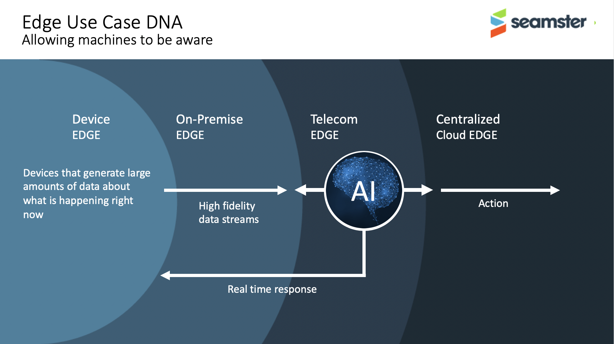

# AI Data Pipelines - Visual Example

Distributed AI data pipeline design for edge analysis of video streams

## Introduction

Online is starting to shadow offline and combine the physical world with potential digital overlays and real time interpretations. This forces the need for different software design patterns that support asynchronous interactions, across heterogeneous end points, that require real time insights with possible associated actions. These needs are seen equally applied to autonomous vehicles as well as XR experiences, for example.  The design pattern that supports these interactions at scale is the "AI data pipeline", which rather than being a client/server interaction, is more of a continous processing, response, distribution, mesh design.  The [Seamster](https://seamster.io) initiative, started by MobiledgeX, first saw this foundational pattern when modeling all edge use cases, across all industries.


This repo implements a simple example of an AI data pipeline applied to real time visual processing. It leverages [Nats](https://nats.io) as the distributed messaging underlay. The design clearly shows both the bandwidth saving potential, as well as the security/privacy mechanisms for information redaction. 

All implementation is in Python 3 but due to the neutrality of the messaging system [nats.io](https://nats.io), all languages can be used and all can interwork.

## Prerequisites

This repo has been validated with the below installation.

```bash
# Python 
$ python3 --version
Python 3.7.12

# Docker
$ docker --version
Docker version 20.10.8, build 3967b7d

$ pip --version
pip 21.2.4

$ virtualenv --version
20.8.0

```

## Tested Environment

### Operating system

- macOS Big Sur 11.6

**RELEASE-NOTE-2** - The author has only validated this works in a macbook environment. There may be incompatibilities with Windows and/or Linux

## Installing

To get your code up and running, first let's clone the repo locally then compose the project:

```bash
cd <PATH_OF_CHOICE>
git clone https://github.com/eusholli/image-pipeline
cd image-pipeline/
```

An overall install.sh file has been provided in the main project directory (image-pipeline).

### To install all processes in one go

While in the main project directory (image-pipeline)

```bash
chmod 755 install.sh
./install.sh
```

## Running all processes at one go

There are 5 main processes

| Process | Description |
| :---: | :---------- |
| nats | Secure messaging service |
| publisher.py | Generate video stream, either from a media file or from the webcam |
| imageaiProcessor.py | COCO Mobilenet SSD to identify objects |
| redaction.py | Redaction service to remove objects |
| q-app.py | Web server to allow real time display of the data pipeline|
  

### To Start all processes in one go

While in the main project directory (image-pipeline)

```bash
chmod 755 start.sh
./start.sh
```

### To Stop all processes in one go

While in the main project directory (image-pipeline)

```bash
chmod 755 stop.sh
./stop.sh
```

## To run each process seperately

In each shell selected to run a process, start the virtual env

```bash
cd <main project directory (image-pipeline)>
. venv/bin/activate
```

All processes need to run in parallel and are best started in individual terminals since all processes generate log messages. The order in which the processes are started is important. The Nats messaging infrastrcture must be initialised first.

If no optional command arguments are passed to the processes then the default AI pipeline is started.  

### Nats Messaging

Nats runs in its own docker container and does not need any additional config. To run, stay in the root directory of the project and execute

```bash
docker run -d --name nats -p 4222:4222 --rm nats:latest -DV 
```

### Producer Shell

```bash
python producer/producer.py WEBCAM
```

If special argument WEBCAM is passed to producer.py, the webcam of the macbook is opened as the video source. Examples of other types of video source can be rtsp streams, rtmp streams and video files stored directly on disk. For example...

```bash
 python producer.py ./friends.mp4
 python producer.py rtmp://fms.105.net/live/rmc1
 python producer.py rtsp://192.168.0.13
 $ python -h
 usage: producer [-h] [-f VALUE] [-n NAME] [-t TOPIC] URL | WEBCAM

start sampling a video source

positional arguments:
  URL | WEBCAM          the video source, either a media url(rtsp, rtmp) or
                        special string 'webcam'

optional arguments:
  -h, --help            show this help message and exit
  -f VALUE, --frame VALUE
                        process "1 every VALUEth frame fetched"
  -n NAME, --name NAME  set the name of the video source, defaults to "source"
                        if missing
  -t TOPIC, --topic TOPIC
                        set the topic name for publishing the feed, defaults
                        to SOURCE_FRAME
```

For iPhone users it is possible download the [Live Reporter app](https://apps.apple.com/us/app/live-reporter-security-camera/id996017825) for free and use the iPhone as the video streaming source. The application provides an RTSP address once running.

### Imageai Shell

```bash
$ python imageai/imageaiProcessor.py -h
usage: imageaiProcessor [-h] [-t TOPIC] [-i INPUT]

start image recognition on incoming frames

optional arguments:
  -h, --help            show this help message and exit
  -t TOPIC, --topic TOPIC
                        set the topic name for publishing the feed, defaults
                        to IMAGEAI_FRAME
  -i INPUT, --input INPUT
                        set the topic name for reading the incoming feed,
                        defaults to SOURCE_FRAME
  -n NAME, --name NAME  set the display name of this object detection process,
                        defaults to "imageaiProcessor" if missing
```

### Redaction Shell

```bash
$ python imageai/redaction.py -h
usage: redaction [-h] [-t TOPIC] [-i INPUT]
                 [redactedObjects [redactedObjects ...]]

start redacting incoming frames

positional arguments:
  redactedObjects       list of objects to be redacted ex. person cup

optional arguments:
  -h, --help            show this help message and exit
  -t TOPIC, --topic TOPIC
                        set the topic name for publishing the feed, defaults
                        to REDACTION_FRAME
  -i INPUT, --input INPUT
                        set the topic name for reading the incoming feed,
                        defaults to IMAGEAI_FRAME
  -n NAME, --name NAME  set the display name of this redaction process,
                        defaults to "redactionProcessor" if missing
```

### Consumer Shell

Consumer is a python quart/websockets app, q-app.py, that pulls the messages from the Nats bus and makes them available via a webserver on localhost:5000. To run execute the following

```bash
python consumer/q-app.py
```

To view the result go to [https://localhost:5000](https://localhost:5000)

## Advanced

By adding command arguments it is possible to construct very complicated image processing chains with many combinations of multiple producers, filters and outputs.  For example all video cameras in a retail store can be published under the same topic and all feeds processed in combination to find total unique visitors, versus unique visitors per camera.  
